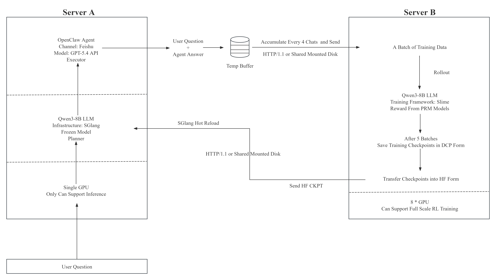

# Openclaw-MIA: Online RL for Agentic Tool-Use

Online reinforcement learning system for agentic tool-use, using binary process reward signals from environment feedback.

## Architecture

The system spans three roles across a distributed setup:

| Role | Key Files | Description |
|------|-----------|-------------|
| **Training Node** | `run_remote_rl.sh`, `remote_rollout.py`, `convert_and_update.sh` | Runs GRPO policy gradient training via Ray + SLIME, converts checkpoints, hot-reloads SGLang |
| **Server A** (data bridge) | `server_a.py`, `sglang_manager.sh`, `sglang_hot_reload.sh` | Collects conversation data from MIA Planner / OpenClaw, receives trained weights, manages local SGLang service |
| **Server B** (data buffer) | `server_b.py`, `push_weight.py` | Buffers collected data for the training node to pull, pushes trained weights back to Server A |

### Data Flow

```
[MIA Planner / OpenClaw]
        │  conversation data
        ▼
[Server A: server_a.py :6333]
        │  POST /receive
        ▼
[Server B: server_b.py :3]
        │  GET /get_data
        ▼
[Training Node: remote_rollout.py → SLIME train_async.py]
        │  checkpoint saved
        ▼
[convert_and_update.sh → HF format]
        │  SGLang hot-reload / push_weight to Server A
        ▼
[SGLang inference service updated]
```

<h1 align="center"></h1>

## Method Overview

The policy model is deployed as an OpenAI-compatible chat proxy. External environments send multi-turn conversations through this proxy. For each main-line turn, the system:

1. Forwards the request to the policy model (served by SGLang) and collects the response along with per-token log-probabilities.
2. When the next turn arrives, its user/environment message serves as the "next state" for the previous turn.
3. A **Process Reward Model (PRM)** judges the previous response quality given the next state via majority vote (`m` independent evaluations), scoring each turn as `+1` (good), `−1` (bad), or `0` (neutral).
4. The majority-voted score becomes the scalar reward for that turn.
5. Turns without a next state are excluded from training (`loss_mask = 0`), unless they are the only turn in the session.

### Advantage Estimation (GRPO)

Advantages are computed using **Group Relative Policy Optimization**. For each sample with scalar reward `r`, the advantage is broadcast uniformly to all response tokens:

$$A_t = r, \quad \forall t \in \text{response tokens}$$

No reward normalization is applied.

### Policy Gradient Loss

Standard PPO-style clipped surrogate with asymmetric clipping ($\varepsilon = 0.2$, $\varepsilon_{\text{high}} = 0.28$):

$$\mathcal{L}_{\text{pg}} = -\mathbb{E}_t\Big[\min\!\big(\rho_t A_t,\ \text{clip}(\rho_t,\, 1{-}\varepsilon,\, 1{+}\varepsilon_{\text{high}}) \cdot A_t\big)\Big]$$

### Total Loss

$$\mathcal{L} = \mathcal{L}_{\text{pg}} + \beta_{\text{KL}} \cdot \mathcal{L}_{\text{KL}}$$

where $\beta_{\text{KL}} = 0.02$, entropy bonus disabled.

## File Structure

```
mia-train/
├── README.md                          # This file (English)
├── README_cn.md                       # Chinese documentation
│
│  ── Training Node ──
├── run_remote_rl.sh                   # Main launch script (Ray + SLIME training job)
├── remote_rollout.py                  # Fetches training data from Server B, converts to SLIME Samples
├── convert_and_update.sh              # Converts DCP checkpoints to HF format + triggers SGLang hot-reload
│
│  ── Server A (Data Bridge, port 6333) ──
├── server_a.py                        # Flask API: collects conversation data → forwards to Server B, receives weights
├── collect_service.py                 # Background daemon: file-based conversation collection
├── conversation_monitor_local.py      # Pairs user/assistant messages and saves to local jsonl files
├── sglang_manager.sh                  # SGLang service management (start/stop/hot-update)
├── sglang_hot_reload.sh              # Watches HF weight directory, triggers SGLang hot-reload on new weights
│
│  ── Server B (Data Buffer, port 3) ──
├── server_b.py                        # Flask API: data buffer for training node to pull from
├── push_weight.py                     # Pushes trained weights back to Server A
│
│  ── Utilities ──
└── openclaw_forward.py                # Converts jsonl files → conversation_complete format, forwards to Server B
```

## How to Run

## Requirements

This project needs the https://github.com/Gen-Verse/OpenClaw-RL/tree/main/slime and https://github.com/Gen-Verse/OpenClaw-RL/tree/main/Megatron-LM. You need to download them and put them with the whole project in the same folder.

### Training Node

```bash
cd slime
bash ../mia-train/run_remote_rl.sh
```

Key environment variables: `NUM_GPUS`, `ACTOR_GPUS`, `ROLLOUT_GPUS`, `PRM_GPUS`, `SERVER_A_URL`, `SERVER_B_URL`, `HF_CKPT`, `SAVE_CKPT`.

### Server A

```bash
python server_a.py
# Runs on port 6333
```

### Server B

```bash
python server_b.py
# Runs on port 3
```

### Data Forwarding (jsonl → Server B)

```bash
# Watch a directory and forward jsonl files
python openclaw_forward.py /path/to/jsonl_dir --server-b-url http://server-b:3

# Mock data for testing
python openclaw_forward.py mock 5
python openclaw_forward.py mock continuous 10
```

## Dependencies

- **Training Node**: `slime`, `Megatron-LM`, `transformers`, `ray`, `sglang`
- **Server A/B**: `flask`, `requests`, `waitress` (optional, for production)


## Acknowledgement

OpenClaw-RL Project [https://github.com/Gen-Verse/OpenClaw-RL]
